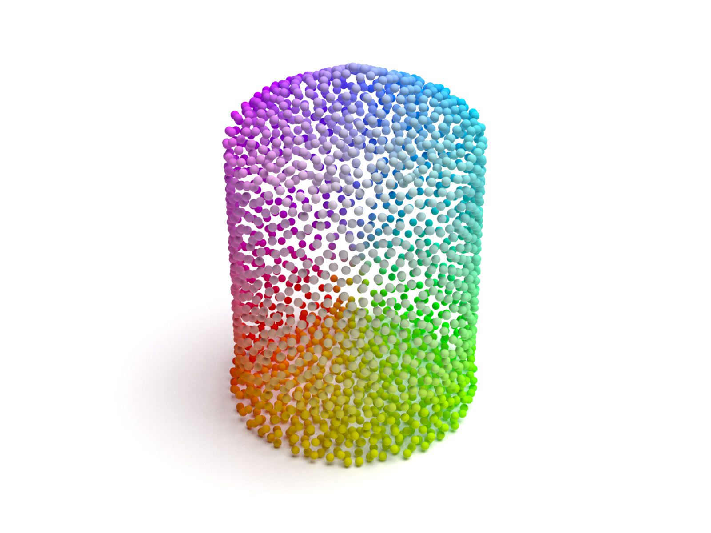
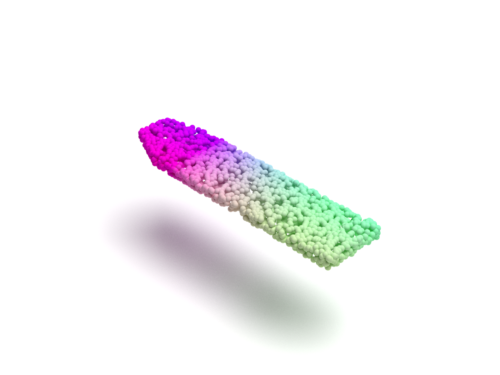
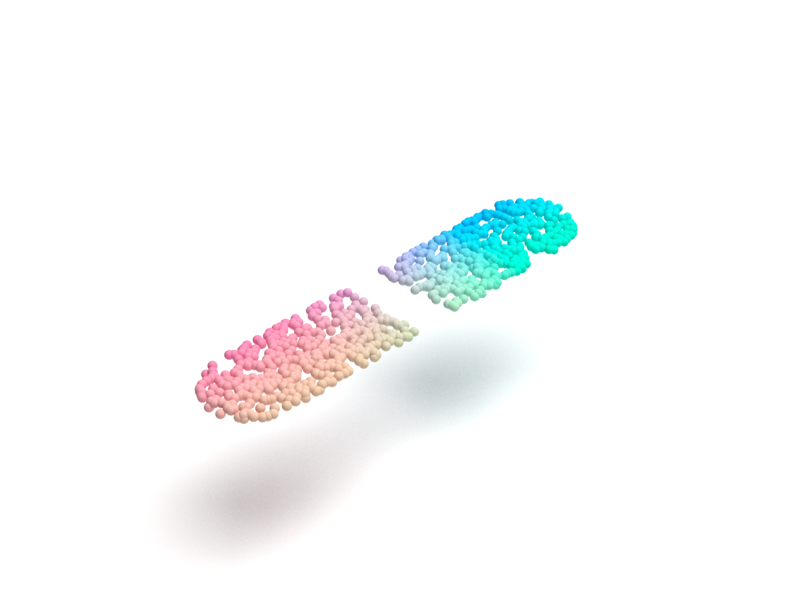
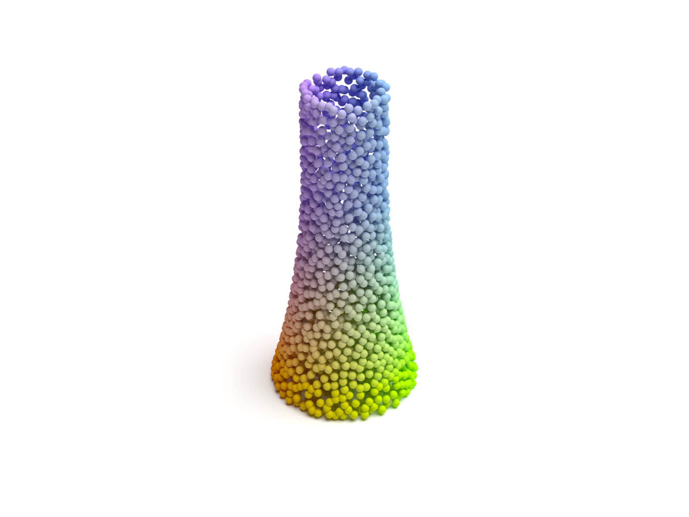
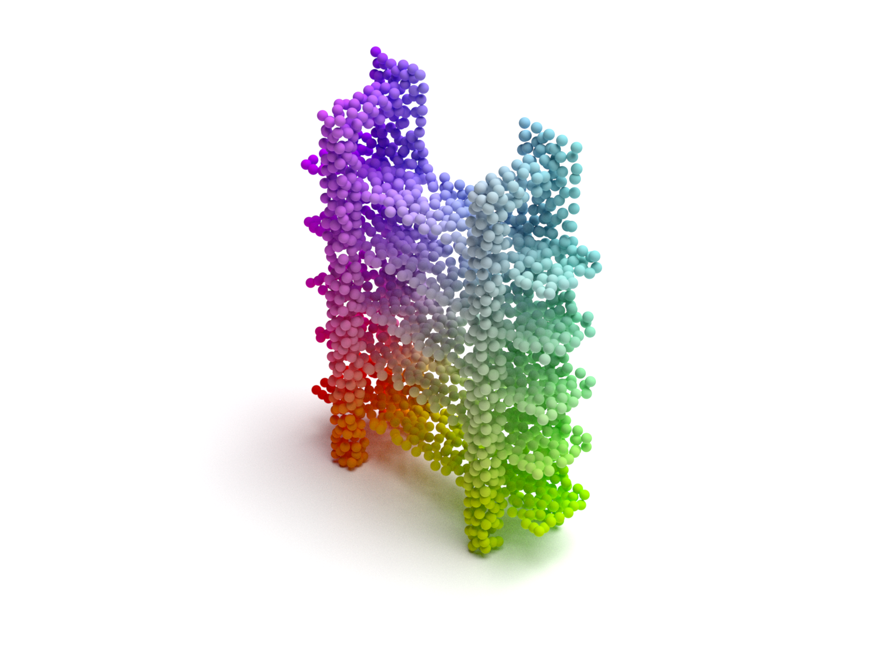

# Point Cloud Datasets

This repository provides ShapeNetCore.v2, ShapeNetPart, ShapeNetPart Part, ModelNet40 and ModelNet10 datasets in HDF5 format. For each shape in these datasets, we use farthest point sampling algorithm to uniformly sample 2,048 points from shape surface. All points are then centered and scaled. We follow the train/val/test split in official documents.

We also provide code to load and visualize our datasets with PyTorch 1.2 and Python 3.7. See `dataset.py` and run it to have a try.

To visualize, run `visualize.py` to generate XML file and use [Mitsuba](https://www.mitsuba-renderer.org/index.html) to render it. Our code is from this [repo](https://github.com/zekunhao1995/PointFlowRenderer). 

&nbsp;
## Download link:

- ShapeNetCore.v2 (0.98G)&ensp;[[Dropbox]](https://www.dropbox.com/s/cszkbla2pgglapb/shapenetcorev2_hdf5_2048.zip?dl=0)&ensp;[[BaiduDisk]](https://pan.baidu.com/s/154As2kzHZczMipuoZIc0kg)
- ShapeNetPart (338M)&ensp;[[Dropbox]](https://www.dropbox.com/s/i54hoc0p9rvkh3n/shapenetpart_hdf5_2048.zip?dl=0)&ensp;[[BaiduDisk]](https://pan.baidu.com/s/1yi4bMVBE2mV8NqVRtNLoqw)
- ShapeNetPart Part (450M)&ensp;[[Dropbox]](https://www.dropbox.com/s/fy6el7hc7r36e0j/shapenetpartpart_hdf5_2048.zip?dl=0)&ensp;[[BaiduDisk]](https://pan.baidu.com/s/1uCotFveZ5R5ztRPIm1hfJQ)
- ModelNet40 (194M)&ensp;[[Dropbox]](https://www.dropbox.com/s/ea4arug1itihb8f/modelnet40_hdf5_2048.zip?dl=0)&ensp;[[BaiduDisk]](https://pan.baidu.com/s/1NQZgN8tvHVqQntxefcdVAg)
- ModelNet10 (72.5M)&ensp;[[Dropbox]](https://www.dropbox.com/s/d5tnwg2legbd6rh/modelnet10_hdf5_2048.zip?dl=0)&ensp;[[BaiduDisk]](https://pan.baidu.com/s/1tfnKQ_yg3SfIgyLSwQ2E0g)

&nbsp;
## ShapeNetCore.v2
ShapeNetCore.v2 datset contains 51,127 pre-aligned shapes from 55 categories, which are split into 35,708 (70%) for training, 5,158 (10%) shapes for validation and 10,261 (20%) shapes for testing. In official document there should be 51,190 shapes in total, but 63 shapes are missing in original downloaded ShapeNetCore.v2 dataset from [here](https://www.shapenet.org/download/shapenetcore). 

Some visualized point clouds in our ShapeNetCore.v2 dataset:

    
     
    

&emsp;&emsp;&emsp;&emsp;&emsp;earphone&emsp;&emsp;&emsp;&emsp;&emsp;&emsp;&emsp;&emsp;&emsp;&emsp;&emsp;lamp&emsp;&emsp;&emsp;&emsp;&emsp;&emsp;&emsp;&emsp;&emsp;&emsp;&emsp;&emsp;tower

&nbsp;
## ShapeNetPart
ShapeNetPart dataset contains 16,881 pre-aligned shapes from 16 categories, annotated with 50 segmentation parts in total. Most object categories are labeled with two to five segmentation parts. There are 12,137 (70%) shapes for training, 1,870 (10%) shapes for validation, and 2,874 (20%) shapes for testing. We also pack the segementation label in our dataset. The link for official dataset is [here](https://shapenet.cs.stanford.edu/media/shapenet_part_seg_hdf5_data.zip).

Although ShapeNetPart is made from ShapeNetCore, the number of points per shape in official ShapeNetPart dataset is not very large and sometimes less than 2,048. Thus the uniform sampling quality of our ShapeNetPart dataset is lower than our ShapeNetCore.v2 dataset. 

In this dataset, we change segmentation label for each point into range 0~49 according to its category. You can find a index mapping list in `dataset.py`.

Some visualized point clouds in our ShapeNetPart dataset:

    
    
    

&emsp;&emsp;&emsp;&emsp;&emsp;airplane&emsp;&emsp;&emsp;&emsp;&emsp;&emsp;&emsp;&emsp;&emsp;&emsp;&emsp;&ensp;table&emsp;&emsp;&emsp;&emsp;&emsp;&emsp;&emsp;&emsp;&emsp;&emsp;&emsp;&emsp;&ensp;chair

&nbsp;
## ShapeNetPart Part (New)
In this dataset, we seperate segmentation parts of a shape as new shapes and make this new dataset from ShapeNetPart dataset. Segmentation parts with point number less than 100 are ignored. ShapeNetPart Part dataset contains 47,808 pre-aligned shapes from 16 categories, annotated with 50 segmentation parts in total. There are 33,761 (70%) shapes for training, 5,311 (10%) shapes for validation, and 7,736 (20%) shapes for testing. We use farthest point sampling algorithm to uniformly sample 2,048 points for each new shape. Following our settings in ShapeNetPart dataset, we change segmentation label for each point into range 0~49 according to its category. 

Some visualized point clouds in our ShapeNetPart Part dataset:

    
    
    

&emsp;&emsp;&emsp;&emsp;&emsp;&emsp;chair&emsp;&emsp;&emsp;&emsp;&emsp;&emsp;&emsp;&emsp;&emsp;&emsp;&ensp;skateboard&emsp;&emsp;&emsp;&emsp;&emsp;&emsp;&emsp;&emsp;&emsp;&emsp;&ensp;airplane

&nbsp;
## ModelNet40
ModelNet40 dataset contains 12,311 pre-aligned shapes from 40 categories, which are split into 9,843 (80%) for training and 2,468 (20%) for testing. The link for official dataset is [here](http://3dvision.princeton.edu/projects/2014/3DShapeNets/ModelNet10.zip).

**Note**: The widely used 2,048 points sampled ModelNet40 dataset ([link](https://shapenet.cs.stanford.edu/media/modelnet40_ply_hdf5_2048.zip)) only contains 9,840 shapes for training, not 9,843 in official. Our ModelNet40 dataset fixs this problem and can substitute the above mentioned dataset perfectly.

Some visualized point clouds in our ModelNet40 dataset:

    
    
    

&emsp;&emsp;&emsp;&emsp;&emsp;&emsp;vase&emsp;&emsp;&emsp;&emsp;&emsp;&emsp;&emsp;&emsp;&emsp;&emsp;&emsp;bookshelf&emsp;&emsp;&emsp;&emsp;&emsp;&emsp;&emsp;&emsp;&emsp;&emsp;&emsp;&emsp;plant

&nbsp;
## ModelNet10
ModelNet10 dataset is a part of ModelNet40 dataset, containing 4,899 pre-aligned shapes from 10 categories. There are 3,991 (80%) shapes for training and 908 (20%) shapes for testing. The link for official dataset is [here](http://modelnet.cs.princeton.edu/ModelNet40.zip).

&nbsp;
## Dataset performance
Repos below use our datasets:

- [AnTao97/UnsupervisedPointCloudReconstruction](https://github.com/AnTao97/UnsupervisedPointCloudReconstruction)
- coming soon ...

&nbsp;

#### Reference repos:  

- [charlesq34/pointnet](https://github.com/charlesq34/pointnet)
- [charlesq34/pointnet2](https://github.com/charlesq34/pointnet2)  
- [stevenygd/PointFlow](https://github.com/stevenygd/PointFlow)  
- [zekunhao1995/PointFlowRenderer](https://github.com/zekunhao1995/PointFlowRenderer)
- [WangYueFt/dgcnn](https://github.com/WangYueFt/dgcnn)  

